  

<h1>
     <i>
        
 Hello everybody!!!  
               My name is Cristian Ariel Achetoni,  
               I'm Full Stack Developer 💻⚡
        

    </i>
</h1>

## ✍ Languages and Tools

| JavaScript | React JS| Redux | Node JS | Express | PostgreSQL | Sequelize | HTML | CSS | Trello | Slack |

  
    &nbsp;
  
    &nbsp;
  
    &nbsp;
  
    &nbsp;
  
    &nbsp;
  
    &nbsp;
  
    &nbsp;
  
    &nbsp;
  
    &nbsp;
  
    &nbsp;
  

&nbsp;

<h2 align="center">About me</h2>

Who I am? 🙆‍♂️
Full stack developer. Carrying out recently completed individual and team projects increases my interest and passion for technology ✨. I have the ability to carry out web projects always keeping in mind that they are scalable and customizable in order to build as a team.

Why me? 🚀
All the members of this community have excellent technical skills, however with me you will get a curious developer with great problem solving skills and above all a developer always willing to teach and learn from others.

💼 Experiences...
- My experience has been quite varied, going through the academic field as well as jobs in a dependency relationship. I finished my degree in Industrial Engineering to later work in different industries, where I obtained several skills, such as teamwork methodologies, project execution, production planning and control, administrative and commercial management.
- Academic experiences in the SoyHenry Bootcamp:
    * Remote team development of a car rental service, with all the requirements and desirable features, time trial and weekly sprints, understanding the information flows and workflows in Git, obtaining an application of the expected quality.
    
    * Personal project, a SPA with Backend in Node, Express, and Sequelize in PostgreSQL, consumed an external API and added functionality to it. The Frontend was achieved with React, Redux and CSS.

It is my desire to join projects in the short, medium or long term, improve current knowledge, and learn much more, always more!🚀

I am a person who is results oriented, curious, good communication skills, analytical thinking, ability to solve problems, a great ability to learn new tools and technologies, responsible, honest, optimistic, flexible and committed. Always predisposed to collaborate, learn and continue to improve as a professional.

If you are interested in my profile, keep looking at my LinkedIn or, much better, contact me and we will organize an interview so that I can tell you in person! 🤗

&nbsp;

## 📫 How to reach me

    &nbsp;&nbsp;&nbsp;

    &nbsp;&nbsp;&nbsp;

&nbsp;
&nbsp;

## 📌 Some screenshots of my proyects:

### FullStack Developer - LUXURENT:

---
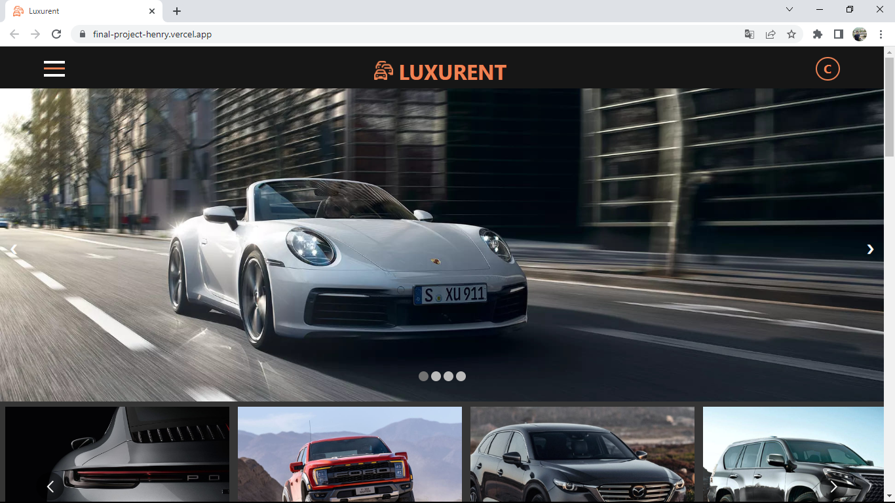
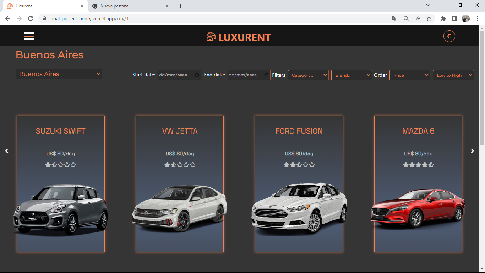
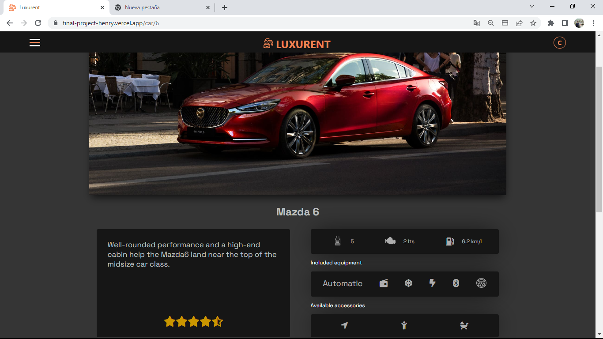
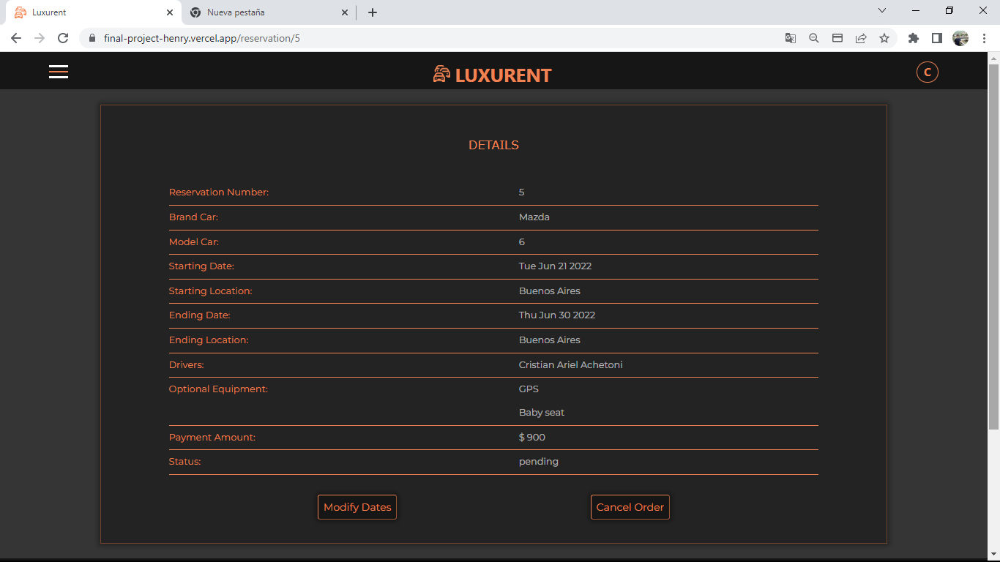
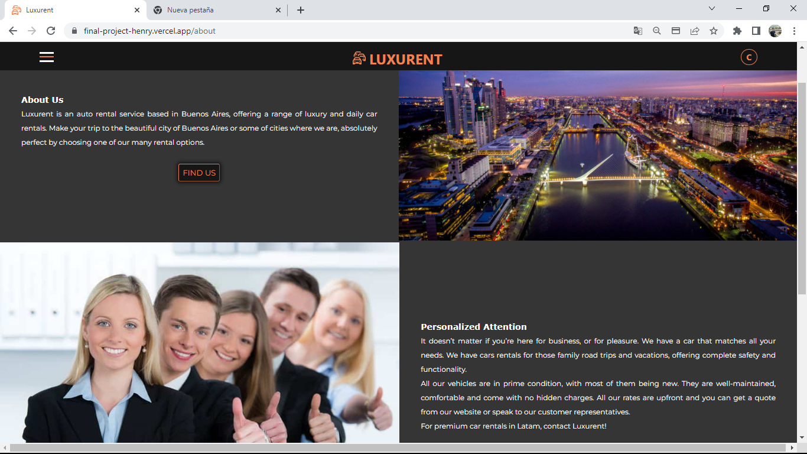

### FullStack Developer - PI-POKÉMON:

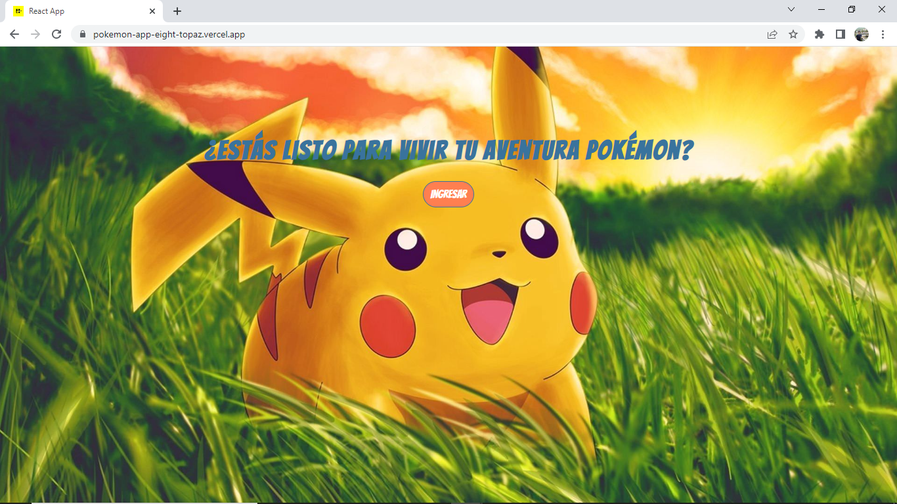
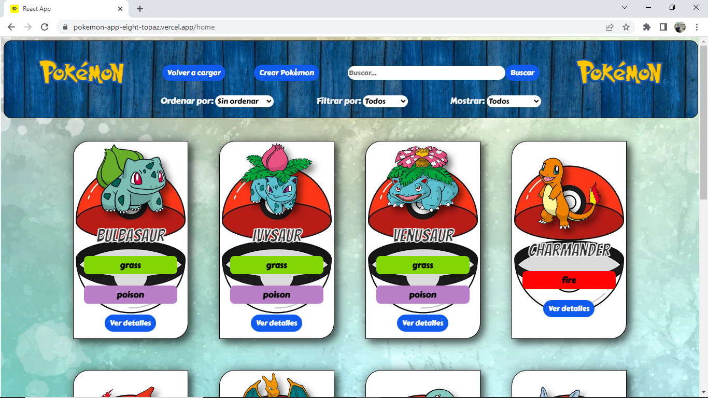
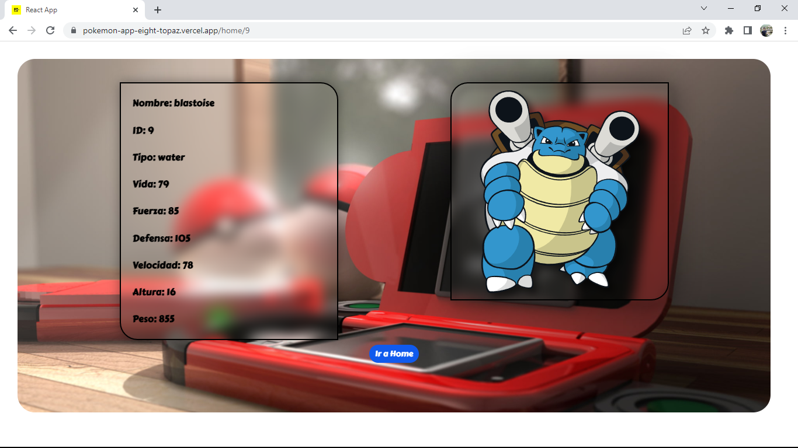
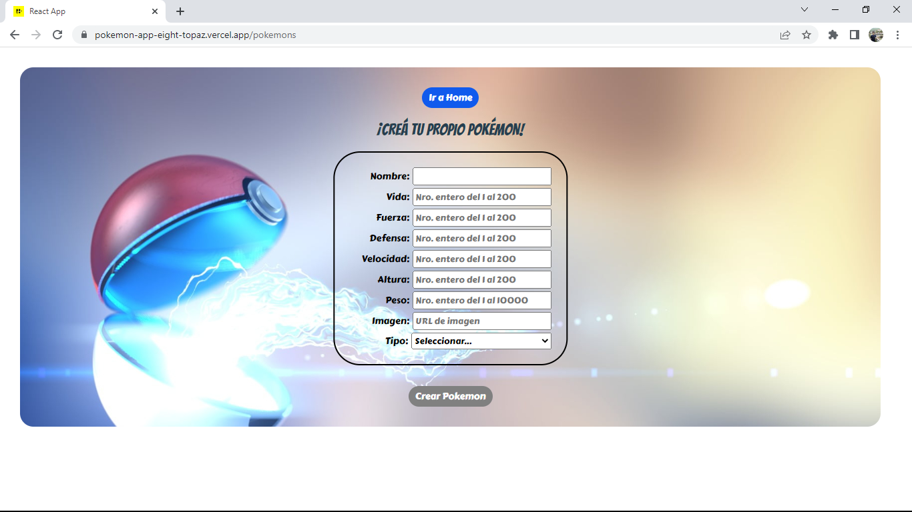

### FullStack Developer - BOOKS-APP:

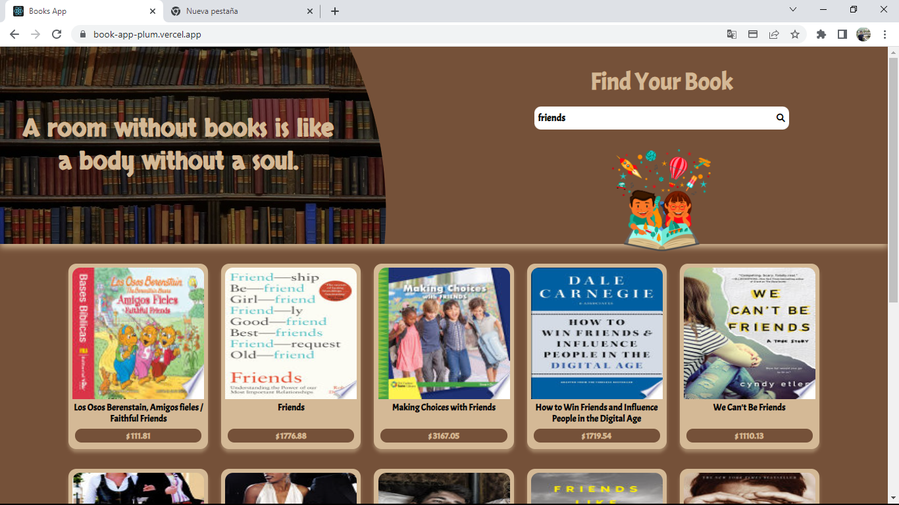
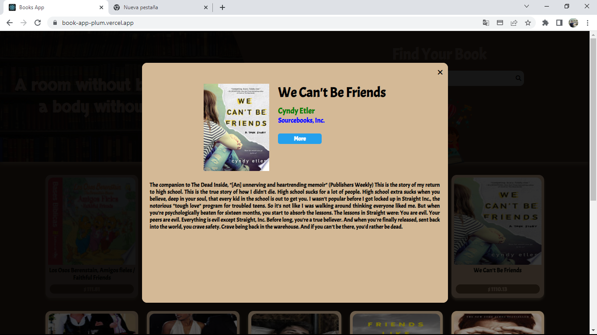

---